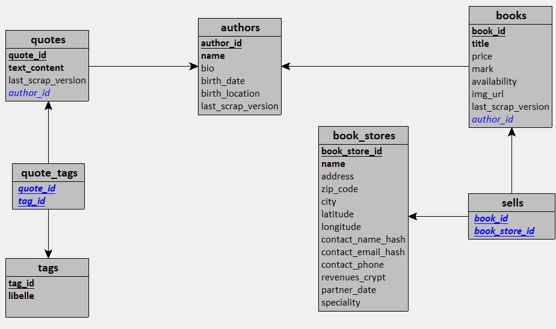

 #DAT

 ## Architecture technique
 
 ### Les données brutes sont stockées dans une instance de minio.
 Les données brutes (couche bronze) sont conservées sous formes :
 - fichiers client excel fournis qui doivent être conservés tel quels.
 - fichiers json qui sont le résultat du scraping

 Minio permet de versionner les fichiers de scraping car on souhaite conserver les changements du site pour 
 avoir un historique. Le scraping ne garantit pas la pérennité des données. En cas de changement du contenu html, 
 il sera possible de retrouver les données sur d'ancienne version.

Chaque type de données est stockée dans son propre bucket. Idéalement les données clients (partner) 
 qui contiennent devraient être stockées dans un bucket avec des droits plus stricts, uniquement les personnes autorisées.
 L'application qui pourrait à terme avoir à gérer des données confidentielles (CA) doit avoir accès à ce bucket.
 Les buckets de scraping sont libres d'accès (données publiques).

 ### Les données raffinées (nettoyées, anonymisées, silver) sont stockées dans une base de données SQL

Les données recherchées sont relativement structurées et ne devraient pas changer régulièrement.
Il convient donc de les stocker dans une base de données structurée pour profiter de la puissance du SQL,
qui permet une richesse d'agrégation plus poussée (et plus simple) qu'une alternative Nosql.
Postgres est le SGBD retenu, car fiable, puissant et open-source, connu et utilisé par la structure.

### Les données d'aggrégation et d'analyse (gold) font pas l'objet d'un stockage dans l'immédiat

Les requêtes SQL sont stockées sur le fichier anaylse.sql. La mise à disposition des résultats pourrait intervenir dans un second temps (API ?)

 
        ┌──────────────────┐        ┌────────────────────┐
        │     SCRAPERS     │        │  FICHIERS CLIENTS  │
        │                  │        │        (XLS)       │
        └─────────┬────────┘        └───────────┬────────┘
                  │                             │
                  └──────────────┬──────────────┘
                                 ▼
                       ┌──────────────────┐
                       │      MINIO       │
                       │ - fichiers scrap │
                       │ - client         │
                       │ - image livres   │                       
                       │ - versionning    │
                       └─────────┬────────┘
                                 │
                   ┌─────────────▼─────────────┐
                   │   Traitements             │
                   │  - anonymisation clients  │
                   │  - ajout geoloc (api)     |
                   |  - nettoyage              │
                   └─────────────┬─────────────┘
                                 │
                                 ▼
                       ┌──────────────────┐
                       │       SQL        │
                       │   (PostgreSQL)   │
                       └──────────────────┘

## couche SQL

On respecte les bonnes pratiques sans normaliser à outrance. 
On relie les données des différentes sources par des clés étrangères facultatives.
Cela permettra de faire évoluer les données si nous avons la 
possibilité de les relier entre elles.

## RGPD

La seule source de données contenant des données personnelles sont les fichiers clients excel.
Ils doivent être stockés dans un bucket sécurisé et faire l'objet d'un recueil de consentement 
(donné lors de la mise en place du partenariat). Elles ne doivent pas quitter l'espace sécurisé,
 où elles sont stockées. L'application n'a pas à les utiliser et tous les traitements faits sur ces données 
 sont sur la base de comparaison. Un hachage de ces données permet de leur donner une forme cohérente 
 (vérifier leur cohérence) tout en rendant les informations personnelles inaccessibles.
Seul le compte de service de production (et les personnes autorisées) ont accès au bucket.
Pas l'équipe de développement.